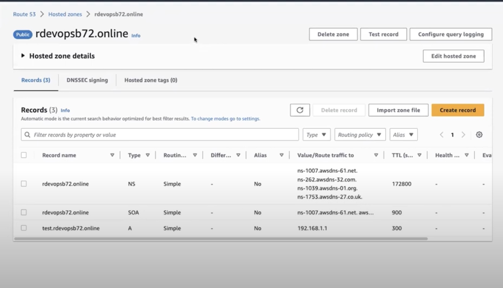
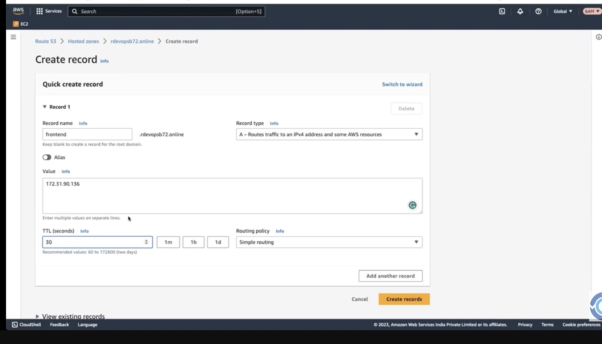
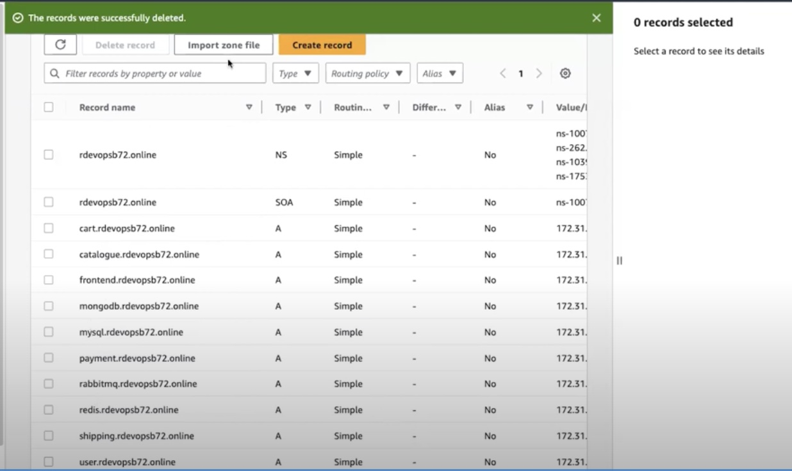

# Learn Shell

Shell Scripting, we learn Bash Shell Scripting

List of Topics:

1. Comments
2. Print
3. Variables
4. Functions
5. Conditions
6. Loops
7. Exit Status & Redirectors & Quotes
8. SED Editor

---

# RoboShop Project Shell Script

#### Functional and non-functional requirements

Thet are aspects of software development that define what a system or application should do and how it should perform. While these concepts are typically associated with software development, they are not directly related to Bash scripting, which is used for writing scripts and automation tasks in the Unix-like shell environment.

However, you can certainly incorporate functional and non-functional requirements into your Bash scripts by ensuring that your scripts fulfill the desired functionality and meet performance expectations. Here's how you might approach this:

##### Functional Requirements in Bash Scripting:

Functional requirements describe what the software should do and what features it should have. In the context of a Bash script, this could involve automating certain tasks, processing data, or performing specific actions.

For example, if you were tasked with creating a Bash script that backs up a directory, your functional requirements might include:

- The script should create a compressed archive of the specified directory.
- The script should include a timestamp in the archive filename.
- The script should store the archive in a designated backup directory.

#### Non-Functional Requirements in Bash Scripting:

Non-functional requirements focus on how well the software performs its functions. In the context of a Bash script, these requirements might encompass factors like performance, reliability, security, and usability.

Continuing with the backup script example, some non-functional requirements could be:

1. **Performance:** The script should efficiently compress the archive to minimize processing time.
2. **Reliability:** The script should handle errors gracefully and provide informative error messages.
3. **Security:** The script should ensure that sensitive data is not exposed and follows best practices for file permissions.
4. **Usability:** The script should have clear and informative usage instructions when invoked with incorrect parameters.
   Keep in mind that while these concepts can be applied to Bash scripting, they are often more directly associated with traditional software development. If you're working on a larger project that involves both script development and software development, you may need to document and manage your functional and non-functional requirements separately, based on the scope and nature of the project.

#### Rout 53



- create record
  
  

### 01. Frontend

- Note: serveices install with sudo user - centos user not have access to install packages

Developer has chosen Nginx as a web server and thus we will install Nginx Web Server.

- create a file name nginx-roboshop.conf

```conf
proxy_http_version 1.1;
location /images/ {
  expires 5s;
  root   /usr/share/nginx/html;
  try_files $uri /images/placeholder.jpg;
}
location /api/catalogue/ { proxy_pass http://localhost:8080/; }
location /api/user/ { proxy_pass http://localhost:8080/; }
location /api/cart/ { proxy_pass http://localhost:8080/; }
location /api/shipping/ { proxy_pass http://localhost:8080/; }
location /api/payment/ { proxy_pass http://localhost:8080/; }

location /health {
  stub_status on;
  access_log off;
}

```

- create a frontend.sh bash script

```sh
#!/bin/bash
# install nginx
yum install nginx -y
cp nginx-roboshop.conf /etc/nginx/default.d/roboshop.conf

# remove old content
rm -rf /usr/share/nginx/html/*
# download frontend
curl -o /tmp/frontend.zip https://roboshop-artifacts.s3.amazonaws.com/frontend.zip
cd /usr/share/nginx/html
# extract frontend
unzip /tmp/frontend.zip

# enable nginx
systemctl enable nginx
systemctl restart nginx

```

### 02. MongoDB

Developer has chosen the database MongoDB. Hence, we are trying to install it up and configure it.

<div style="background-color: #d8f5e1; padding: 10px; border-radius: 5px;">
<span style="display:inline-flex;margin-right: 0.4em;vertical-align: middle;">
  <svg style="display:inline-flex;height:1.6em;width:1.6em;" viewBox="0 0 12 16"><path fill-rule="evenodd" d="M6.5 0C3.48 0 1 2.19 1 5c0 .92.55 2.25 1 3 1.34 2.25 1.78 2.78 2 4v1h5v-1c.22-1.22.66-1.75 2-4 .45-.75 1-2.08 1-3 0-2.81-2.48-5-5.5-5zm3.64 7.48c-.25.44-.47.8-.67 1.11-.86 1.41-1.25 2.06-1.45 3.23-.02.05-.02.11-.02.17H5c0-.06 0-.13-.02-.17-.2-1.17-.59-1.83-1.45-3.23-.2-.31-.42-.67-.67-1.11C2.44 6.78 2 5.65 2 5c0-2.2 2.02-4 4.5-4 1.22 0 2.36.42 3.22 1.19C10.55 2.94 11 3.94 11 5c0 .66-.44 1.78-.86 2.48zM4 14h5c-.23 1.14-1.3 2-2.5 2s-2.27-.86-2.5-2z"></path></svg>
  Hint
  </span>
  <br>
  Versions of the DB Software you will get context from the developer. Meaning we need to check with the developer. Developer has shared the version information as MongoDB-4.x.
</div>
<br>

- Setup the MongoDB repo file name: mongo.repo

```file
[mongodb-org-4.2]
name=MongoDB Repository
baseurl=https://repo.mongodb.org/yum/redhat/$releasever/mongodb-org/4.2/x86_64/
gpgcheck=0
enabled=1
```

- Install MongoDB

```sh
yum install mongodb-org -y

```

- Start & Enable MongoDB Service

```sh
systemctl enable mongod
systemctl start mongod
```

Usually MongoDB opens the port only to localhost(127.0.0.1), meaning this service can be accessed by the application that is hosted on this server only. However, we need to access this service to be accessed by another server, So we need to change the config accordingly.

- Update listen address from 127.0.0.1 to 0.0.0.0 in /etc/mongod.conf

- Restart the service to make the changes effected.

```sh
systemctl restart mongod
```

### 03. Catalogue

Catalogue is a microservice that is responsible for serving the list of items that displays in roboshop application.

<div style="background-color: #d8f5e1; padding: 10px; border-radius: 5px;">
<span style="display:inline-flex;margin-right: 0.4em;vertical-align: middle;">
  <svg style="display:inline-block;height:1.6em;width:1.6em;" viewBox="0 0 12 16"><path fill-rule="evenodd" d="M6.5 0C3.48 0 1 2.19 1 5c0 .92.55 2.25 1 3 1.34 2.25 1.78 2.78 2 4v1h5v-1c.22-1.22.66-1.75 2-4 .45-.75 1-2.08 1-3 0-2.81-2.48-5-5.5-5zm3.64 7.48c-.25.44-.47.8-.67 1.11-.86 1.41-1.25 2.06-1.45 3.23-.02.05-.02.11-.02.17H5c0-.06 0-.13-.02-.17-.2-1.17-.59-1.83-1.45-3.23-.2-.31-.42-.67-.67-1.11C2.44 6.78 2 5.65 2 5c0-2.2 2.02-4 4.5-4 1.22 0 2.36.42 3.22 1.19C10.55 2.94 11 3.94 11 5c0 .66-.44 1.78-.86 2.48zM4 14h5c-.23 1.14-1.3 2-2.5 2s-2.27-.86-2.5-2z"></path></svg>
  Hint
  </span>
  <br>
  Developer has chosen NodeJs, Check with developer which version of NodeJS is needed. Developer has set a context that it can work with NodeJS >18

</div>
<br>

1. Setup NodeJS repos. Vendor is providing a script to setup the repos.

```sh
curl -sL https://rpm.nodesource.com/setup_lts.x | bash
```

2.  To have it installed the MongoDB repo ,we have to creatte a file `mongo.repo`

```mongo.repo
[mongodb-org-4.2]
name=MongoDB Repository
baseurl=https://repo.mongodb.org/yum/redhat/$releasever/mongodb-org/4.2/x86_64/
gpgcheck=0
enabled=1
```

3. copy the file in `/etc/yum.repos.d/mongo.repo`

```sh
cp mongo.repo /etc/yum.repos.d/mongo.repo
```

We need to setup a new service in <strong>systemd</strong> so systemctl can manage this service

<div style="background-color: #eef9fd; padding: 10px; border-radius: 5px;border-left:4px solid #4cb3d4">
<span style="display:inline-flex;margin-right: 0.4em;vertical-align: middle;">
 <svg  style="display:inline-block;height:1.6em;width:1.6em;" viewBox="0 0 14 16"><path fill-rule="evenodd" d="M7 2.3c3.14 0 5.7 2.56 5.7 5.7s-2.56 5.7-5.7 5.7A5.71 5.71 0 0 1 1.3 8c0-3.14 2.56-5.7 5.7-5.7zM7 1C3.14 1 0 4.14 0 8s3.14 7 7 7 7-3.14 7-7-3.14-7-7-7zm1 3H6v5h2V4zm0 6H6v2h2v-2z"></path></svg>
INFO
</span>
<br>
We already discussed in linux basics that advantages of systemctl managing services, Hence we are taking that approach. Which is also a standard way in the OS.
</div>
<br>

4. To Setup a SystemD Catalogue Service. create a file catalogue.service

```service
[Unit]
Description = Catalogue Service

[Service]
User=roboshop
Environment=MONGO=true
Environment=MONGO_URL="mongodb://<MONGODB-SERVER-IPADDRESS>:27017/catalogue"
ExecStart=/bin/node /app/server.js
SyslogIdentifier=catalogue

[Install]
WantedBy=multi-user.target
```

5. Copy catalogue.service at `/etc/systemd/system/catalogue.service`

```sh
cp catalogue.service /etc/systemd/system/catalogue.service
```

6. Install NodeJS

```sh
yum install nodejs -y
```

7. Configure the application.

<div style="background-color: #eef9fd; padding: 10px; border-radius: 5px;border-left:4px solid #4cb3d4">
<span style="display:inline-flex;margin-right: 0.4em;vertical-align: middle;">
 <svg  style="display:inline-block;height:1.6em;width:1.6em;" viewBox="0 0 14 16"><path fill-rule="evenodd" d="M7 2.3c3.14 0 5.7 2.56 5.7 5.7s-2.56 5.7-5.7 5.7A5.71 5.71 0 0 1 1.3 8c0-3.14 2.56-5.7 5.7-5.7zM7 1C3.14 1 0 4.14 0 8s3.14 7 7 7 7-3.14 7-7-3.14-7-7-7zm1 3H6v5h2V4zm0 6H6v2h2v-2z"></path></svg>
INFO
</span>
<br>
Our application developed by the developer of our org and it is not having any RPM software just like other softwares. So we need to configure every step manually

</div>
<br>

<div style="background-color: #fff8e6; padding: 10px; border-radius: 5px;border-left:4px solid #d99e00">
<span style="display:inline-flex;margin-right: 0.4em;vertical-align: middle;">
<svg style="display:inline-block;height:1.6em;width:1.6em;" viewBox="0 0 16 16"><path fill-rule="evenodd" d="M8.893 1.5c-.183-.31-.52-.5-.887-.5s-.703.19-.886.5L.138 13.499a.98.98 0 0 0 0 1.001c.193.31.53.501.886.501h13.964c.367 0 .704-.19.877-.5a1.03 1.03 0 0 0 .01-1.002L8.893 1.5zm.133 11.497H6.987v-2.003h2.039v2.003zm0-3.004H6.987V5.987h2.039v4.006z"></path></svg>
Recap
</span>
<br>
We already discussed in Linux basics section that applications should run as nonroot user.

</div>
<br>

8. Add application User

```sh
useradd roboshop
```

<div style="background-color: #eef9fd; padding: 10px; border-radius: 5px;border-left:4px solid #4cb3d4">
<span style="display:inline-flex;margin-right: 0.4em;vertical-align: middle;">
 <svg  style="display:inline-block;height:1.6em;width:1.6em;" viewBox="0 0 14 16"><path fill-rule="evenodd" d="M7 2.3c3.14 0 5.7 2.56 5.7 5.7s-2.56 5.7-5.7 5.7A5.71 5.71 0 0 1 1.3 8c0-3.14 2.56-5.7 5.7-5.7zM7 1C3.14 1 0 4.14 0 8s3.14 7 7 7 7-3.14 7-7-3.14-7-7-7zm1 3H6v5h2V4zm0 6H6v2h2v-2z"></path></svg>
INFO
</span>
<br>
User <strong>roboshop</strong> is a function / daemon user to run the application. Apart from that we dont use this user to login to server.

Also, username <strong>roboshop</strong> has been picked because it more suits to our project name.

We keep application in one standard location. This is a usual practice that runs in the organization.

</div>
<br>

9. Lets setup an app directory.

```sh
mkdir /app
```

10. Download the application code to created app directory.

```sh
curl -o /tmp/catalogue.zip https://roboshop-artifacts.s3.amazonaws.com/catalogue.zip
cd /app
unzip /tmp/catalogue.zip
```

Every application is developed by development team will have some common softwares that they use as libraries. This application also have the same way of defined dependencies in the application configuration.

11. Lets download the dependencies.

```sh
cd /app
npm install
```

<div style="background-color: #eef9fd; padding: 10px; border-radius: 5px;border-left:4px solid #4cb3d4">
<span style="display:inline-flex;margin-right: 0.4em;vertical-align: middle;">
 <svg  style="display:inline-block;height:1.6em;width:1.6em;" viewBox="0 0 14 16"><path fill-rule="evenodd" d="M7 2.3c3.14 0 5.7 2.56 5.7 5.7s-2.56 5.7-5.7 5.7A5.71 5.71 0 0 1 1.3 8c0-3.14 2.56-5.7 5.7-5.7zM7 1C3.14 1 0 4.14 0 8s3.14 7 7 7 7-3.14 7-7-3.14-7-7-7zm1 3H6v5h2V4zm0 6H6v2h2v-2z"></path></svg>
INFO
</span>
<br>
Hint! You can create file by using <strong>vim /etc/systemd/system/catalogue.service</strong>
</div>
<br>

<div style="background-color: #fff8e6; padding: 10px; border-radius: 5px;border-left:4px solid #d99e00">
<span style="display:inline-flex;margin-right: 0.4em;vertical-align: middle;">
<svg style="display:inline-block;height:1.6em;width:1.6em;" viewBox="0 0 16 16"><path fill-rule="evenodd" d="M8.893 1.5c-.183-.31-.52-.5-.887-.5s-.703.19-.886.5L.138 13.499a.98.98 0 0 0 0 1.001c.193.31.53.501.886.501h13.964c.367 0 .704-.19.877-.5a1.03 1.03 0 0 0 .01-1.002L8.893 1.5zm.133 11.497H6.987v-2.003h2.039v2.003zm0-3.004H6.987V5.987h2.039v4.006z"></path></svg>
NOTE
</span>
<br>
Ensure you replace <MONGODB-SERVER-IPADDRESS> with IP address
</div>
<br>

12. install mongodb-client

```sh
yum install mongodb-org-shell -y
```

13. Load Schema

```sh
mongo --host MONGODB-SERVER-IPADDRESS </app/schema/catalogue.js
```

14. Load the service.

```sh
systemctl daemon-reload
```

<div style="background-color: #eef9fd; padding: 10px; border-radius: 5px;border-left:4px solid #4cb3d4">
<span style="display:inline-flex;margin-right: 0.4em;vertical-align: middle;">
 <svg  style="display:inline-block;height:1.6em;width:1.6em;" viewBox="0 0 14 16"><path fill-rule="evenodd" d="M7 2.3c3.14 0 5.7 2.56 5.7 5.7s-2.56 5.7-5.7 5.7A5.71 5.71 0 0 1 1.3 8c0-3.14 2.56-5.7 5.7-5.7zM7 1C3.14 1 0 4.14 0 8s3.14 7 7 7 7-3.14 7-7-3.14-7-7-7zm1 3H6v5h2V4zm0 6H6v2h2v-2z"></path></svg>
INFO
</span>
<br>
This above command is because we added a new service, We are telling systemd to reload so it will detect new service.
</div>
<br>

15. Start the service.

```sh
systemctl enable catalogue
systemctl restart catalogue
```

For the application to work fully functional we need to load schema to the Database.

<div style="background-color: #e6f6e6; padding: 10px; border-radius: 5px;border-left:4px solid #008b00">
<span style="display:inline-flex;margin-right: 0.4em;vertical-align: middle;">
 <svg  style="display:inline-block;height:1.6em;width:1.6em;" viewBox="0 0 14 16"><path fill-rule="evenodd" d="M7 2.3c3.14 0 5.7 2.56 5.7 5.7s-2.56 5.7-5.7 5.7A5.71 5.71 0 0 1 1.3 8c0-3.14 2.56-5.7 5.7-5.7zM7 1C3.14 1 0 4.14 0 8s3.14 7 7 7 7-3.14 7-7-3.14-7-7-7zm1 3H6v5h2V4zm0 6H6v2h2v-2z"></path></svg>
INFO
</span>
<br>
Schemas are usually part of application code and developer will provide them as part of development.
</div>
<br>

<div style="background-color: #fff8e6; padding: 10px; border-radius: 5px;border-left:4px solid #d99e00">
<span style="display:inline-flex;margin-right: 0.4em;vertical-align: middle;">
<svg style="display:inline-block;height:1.6em;width:1.6em;" viewBox="0 0 16 16"><path fill-rule="evenodd" d="M8.893 1.5c-.183-.31-.52-.5-.887-.5s-.703.19-.886.5L.138 13.499a.98.98 0 0 0 0 1.001c.193.31.53.501.886.501h13.964c.367 0 .704-.19.877-.5a1.03 1.03 0 0 0 .01-1.002L8.893 1.5zm.133 11.497H6.987v-2.003h2.039v2.003zm0-3.004H6.987V5.987h2.039v4.006z"></path></svg>
NOTE
</span>
<br>
You need to update catalogue server ip address in frontend configuration. Configuration file is /etc/nginx/default.d/roboshop.conf

</div>
<br>

### 04. Redis

Redis is used for in-memory data storage(Caching) and allows users to access the data of database over API.

<div style="background-color: #e6f6e6; padding: 10px; border-radius: 5px;border-left:4px solid #008b00">
<span style="display:inline-flex;margin-right: 0.4em;vertical-align: middle;">
 <svg style="display:inline-flex;height:1.6em;width:1.6em;" viewBox="0 0 12 16"><path fill-rule="evenodd" d="M6.5 0C3.48 0 1 2.19 1 5c0 .92.55 2.25 1 3 1.34 2.25 1.78 2.78 2 4v1h5v-1c.22-1.22.66-1.75 2-4 .45-.75 1-2.08 1-3 0-2.81-2.48-5-5.5-5zm3.64 7.48c-.25.44-.47.8-.67 1.11-.86 1.41-1.25 2.06-1.45 3.23-.02.05-.02.11-.02.17H5c0-.06 0-.13-.02-.17-.2-1.17-.59-1.83-1.45-3.23-.2-.31-.42-.67-.67-1.11C2.44 6.78 2 5.65 2 5c0-2.2 2.02-4 4.5-4 1.22 0 2.36.42 3.22 1.19C10.55 2.94 11 3.94 11 5c0 .66-.44 1.78-.86 2.48zM4 14h5c-.23 1.14-1.3 2-2.5 2s-2.27-.86-2.5-2z"></path></svg>
HINT
</span>
<br>
Versions of the DB Software you will get context from the developer, Meaning we need to check with developer.

</div>
<br>

1. Redis is offering the repo file as a rpm. Lets install it

```sh
yum install https://rpms.remirepo.net/enterprise/remi-release-8.rpm -y
```

2. Enable Redis 6.2 from package streams.

```sh
yum module enable redis:remi-6.2 -y
```

3. Install Redis

```sh
yum install redis -y
```

Usually Redis opens the port only to localhost(127.0.0.1), meaning this service can be accessed by the application that is hosted on this server only. However, we need to access this service to be accessed by another server, So we need to change the config accordingly.

4.Update listen address from 127.0.0.1 to 0.0.0.0 in `/etc/redis.conf` & `/etc/redis/redis.conf`

<div style="background-color: #e6f6e6; padding: 10px; border-radius: 5px;border-left:4px solid #008b00">
<span style="display:inline-flex;margin-right: 0.4em;vertical-align: middle;">
 <svg style="display:inline-flex;height:1.6em;width:1.6em;" viewBox="0 0 12 16"><path fill-rule="evenodd" d="M6.5 0C3.48 0 1 2.19 1 5c0 .92.55 2.25 1 3 1.34 2.25 1.78 2.78 2 4v1h5v-1c.22-1.22.66-1.75 2-4 .45-.75 1-2.08 1-3 0-2.81-2.48-5-5.5-5zm3.64 7.48c-.25.44-.47.8-.67 1.11-.86 1.41-1.25 2.06-1.45 3.23-.02.05-.02.11-.02.17H5c0-.06 0-.13-.02-.17-.2-1.17-.59-1.83-1.45-3.23-.2-.31-.42-.67-.67-1.11C2.44 6.78 2 5.65 2 5c0-2.2 2.02-4 4.5-4 1.22 0 2.36.42 3.22 1.19C10.55 2.94 11 3.94 11 5c0 .66-.44 1.78-.86 2.48zM4 14h5c-.23 1.14-1.3 2-2.5 2s-2.27-.86-2.5-2z"></path></svg>
TIP
</span>
<br>
You can edit file by using vim /etc/redis.conf & vim /etc/redis/redis.conf

</div>
<br>

5. Start & Enable Redis Service

```sh
systemctl enable redis
systemctl restart redis
```

### 05. User

User is a microservice that is responsible for User Logins and Registrations Service in RobotShop e-commerce portal.

<div style="background-color: #e6f6e6; padding: 10px; border-radius: 5px;border-left:4px solid #008b00">
<span style="display:inline-flex;margin-right: 0.4em;vertical-align: middle;">
 <svg style="display:inline-flex;height:1.6em;width:1.6em;" viewBox="0 0 12 16"><path fill-rule="evenodd" d="M6.5 0C3.48 0 1 2.19 1 5c0 .92.55 2.25 1 3 1.34 2.25 1.78 2.78 2 4v1h5v-1c.22-1.22.66-1.75 2-4 .45-.75 1-2.08 1-3 0-2.81-2.48-5-5.5-5zm3.64 7.48c-.25.44-.47.8-.67 1.11-.86 1.41-1.25 2.06-1.45 3.23-.02.05-.02.11-.02.17H5c0-.06 0-.13-.02-.17-.2-1.17-.59-1.83-1.45-3.23-.2-.31-.42-.67-.67-1.11C2.44 6.78 2 5.65 2 5c0-2.2 2.02-4 4.5-4 1.22 0 2.36.42 3.22 1.19C10.55 2.94 11 3.94 11 5c0 .66-.44 1.78-.86 2.48zM4 14h5c-.23 1.14-1.3 2-2.5 2s-2.27-.86-2.5-2z"></path></svg>
HINT
</span>
<br>
Developer has chosen NodeJs, Check with developer which version of NodeJS is needed. Developer has set a context that it can work with NodeJS >18
</div>
<br>

curl: This is a command-line tool used to transfer data to or from a server using various protocols. It's commonly used for making HTTP requests, but it supports many other protocols as well.
-s or --silent: This flag tells curl to operate in silent mode, which means it won't show progress or error messages.
-L or --location: This flag tells curl to follow HTTP redirects. If a server responds with a redirect (HTTP status code 3xx), curl will automatically request the new location provided by the server.

1. Setup NodeJS repos. Vendor is providing a script to setup the repos.

```sh
curl -sL https://rpm.nodesource.com/setup_lts.x | bash
```

2.  To have it installed the MongoDB repo ,we have to creatte a file `mongo.repo`

```mongo.repo
[mongodb-org-4.2]
name=MongoDB Repository
baseurl=https://repo.mongodb.org/yum/redhat/$releasever/mongodb-org/4.2/x86_64/
gpgcheck=0
enabled=1
```

3. copy the file in `/etc/yum.repos.d/mongo.repo`

```sh
cp mongo.repo /etc/yum.repos.d/mongo.repo
```

We need to setup a new service in systemd so systemctl can manage this service

<div style="background-color: #eef9fd; padding: 10px; border-radius: 5px;border-left:4px solid #4cb3d4">
<span style="display:inline-flex;margin-right: 0.4em;vertical-align: middle;">
 <svg  style="display:inline-block;height:1.6em;width:1.6em;" viewBox="0 0 14 16"><path fill-rule="evenodd" d="M7 2.3c3.14 0 5.7 2.56 5.7 5.7s-2.56 5.7-5.7 5.7A5.71 5.71 0 0 1 1.3 8c0-3.14 2.56-5.7 5.7-5.7zM7 1C3.14 1 0 4.14 0 8s3.14 7 7 7 7-3.14 7-7-3.14-7-7-7zm1 3H6v5h2V4zm0 6H6v2h2v-2z"></path></svg>
INFO
</span>
<br>
We already discussed in linux basics that advantages of systemctl managing services, Hence we are taking that approach. Which is also a standard way in the OS.

RECAP You can create file by using <strong>vim /etc/systemd/system/user.service</strong>

</div>
<br>

4. Setup SystemD User Service

```sh
cp user.service /etc/systemd/system/user.service
```

5. Install NodeJS

```sh
yum install nodejs -y
```

6. Configure the application. Here

<div style="background-color: #eef9fd; padding: 10px; border-radius: 5px;border-left:4px solid #4cb3d4">
<span style="display:inline-flex;margin-right: 0.4em;vertical-align: middle;">
 <svg  style="display:inline-block;height:1.6em;width:1.6em;" viewBox="0 0 14 16"><path fill-rule="evenodd" d="M7 2.3c3.14 0 5.7 2.56 5.7 5.7s-2.56 5.7-5.7 5.7A5.71 5.71 0 0 1 1.3 8c0-3.14 2.56-5.7 5.7-5.7zM7 1C3.14 1 0 4.14 0 8s3.14 7 7 7 7-3.14 7-7-3.14-7-7-7zm1 3H6v5h2V4zm0 6H6v2h2v-2z"></path></svg>
INFO
</span>
<br>
Our application developed by the user is not having any RPM software just like other softwares. So we need to configure every step manually
</div>
<br>

<div style="background-color: #fff8e6; padding: 10px; border-radius: 5px;border-left:4px solid #d99e00">
<span style="display:inline-flex;margin-right: 0.4em;vertical-align: middle;">
<svg style="display:inline-block;height:1.6em;width:1.6em;" viewBox="0 0 16 16"><path fill-rule="evenodd" d="M8.893 1.5c-.183-.31-.52-.5-.887-.5s-.703.19-.886.5L.138 13.499a.98.98 0 0 0 0 1.001c.193.31.53.501.886.501h13.964c.367 0 .704-.19.877-.5a1.03 1.03 0 0 0 .01-1.002L8.893 1.5zm.133 11.497H6.987v-2.003h2.039v2.003zm0-3.004H6.987V5.987h2.039v4.006z"></path></svg>
Recap
</span>
<br>
We already discussed in Linux basics section that applications should run as nonroot user.

</div>
<br>

7. Add application User

```sh
useradd roboshop
```

<div style="background-color: #eef9fd; padding: 10px; border-radius: 5px;border-left:4px solid #4cb3d4">
<span style="display:inline-flex;margin-right: 0.4em;vertical-align: middle;">
 <svg  style="display:inline-block;height:1.6em;width:1.6em;" viewBox="0 0 14 16"><path fill-rule="evenodd" d="M7 2.3c3.14 0 5.7 2.56 5.7 5.7s-2.56 5.7-5.7 5.7A5.71 5.71 0 0 1 1.3 8c0-3.14 2.56-5.7 5.7-5.7zM7 1C3.14 1 0 4.14 0 8s3.14 7 7 7 7-3.14 7-7-3.14-7-7-7zm1 3H6v5h2V4zm0 6H6v2h2v-2z"></path></svg>
INFO
</span>
<br>
User <strong>roboshop</strong> is a function / daemon user to run the application. Apart from that we dont use this user to login to server.

Also, username <strong>roboshop</strong> has been picked because it more suits to our project name.

We keep application in one standard location. This is a usual practice that runs in the organization.

</div>
<br>

8. Lets setup an app directory.

```sh
mkdir /app
```

9. Download the application code to created app directory.

```sh
curl -L -o /tmp/user.zip https://roboshop-artifacts.s3.amazonaws.com/user.zip
cd /app
unzip /tmp/user.zip
```

Every application is developed by development team will have some common softwares that they use as libraries. This application also have the same way of defined dependencies in the application configuration.

Lets download the dependencies.

```sh
cd /app
npm install
```

10. install mongodb-client

```sh
yum install mongodb-org-shell -y
```

11. Load Schema

```sh
mongo --host MONGODB-SERVER-IPADDRESS </app/schema/user.js
```

12. Load the service.

```sh
systemctl daemon-reload
```

13. Start the service.

```sh
systemctl enable user
systemctl restart user
```

### 06. Cart

Cart is a microservice that is responsible for Cart Service in RobotShop e-commerce portal.

<div style="background-color: #e6f6e6; padding: 10px; border-radius: 5px;border-left:4px solid #008b00">
<span style="display:inline-flex;margin-right: 0.4em;vertical-align: middle;">
 <svg style="display:inline-flex;height:1.6em;width:1.6em;" viewBox="0 0 12 16"><path fill-rule="evenodd" d="M6.5 0C3.48 0 1 2.19 1 5c0 .92.55 2.25 1 3 1.34 2.25 1.78 2.78 2 4v1h5v-1c.22-1.22.66-1.75 2-4 .45-.75 1-2.08 1-3 0-2.81-2.48-5-5.5-5zm3.64 7.48c-.25.44-.47.8-.67 1.11-.86 1.41-1.25 2.06-1.45 3.23-.02.05-.02.11-.02.17H5c0-.06 0-.13-.02-.17-.2-1.17-.59-1.83-1.45-3.23-.2-.31-.42-.67-.67-1.11C2.44 6.78 2 5.65 2 5c0-2.2 2.02-4 4.5-4 1.22 0 2.36.42 3.22 1.19C10.55 2.94 11 3.94 11 5c0 .66-.44 1.78-.86 2.48zM4 14h5c-.23 1.14-1.3 2-2.5 2s-2.27-.86-2.5-2z"></path></svg>
HINT
</span>
<br>
Developer has chosen NodeJs, Check with developer which version of NodeJS is needed.
</div>
<br>

1. Setup NodeJS repos. Vendor is providing a script to setup the repos.

```sh
curl -sL https://rpm.nodesource.com/setup_lts.x | bash
```

We need to setup a new service in systemd so systemctl can manage this service

<div style="background-color: #eef9fd; padding: 10px; border-radius: 5px;border-left:4px solid #4cb3d4">
<span style="display:inline-flex;margin-right: 0.4em;vertical-align: middle;">
 <svg  style="display:inline-block;height:1.6em;width:1.6em;" viewBox="0 0 14 16"><path fill-rule="evenodd" d="M7 2.3c3.14 0 5.7 2.56 5.7 5.7s-2.56 5.7-5.7 5.7A5.71 5.71 0 0 1 1.3 8c0-3.14 2.56-5.7 5.7-5.7zM7 1C3.14 1 0 4.14 0 8s3.14 7 7 7 7-3.14 7-7-3.14-7-7-7zm1 3H6v5h2V4zm0 6H6v2h2v-2z"></path></svg>
INFO
</span>
<br>
We already discussed in linux basics that advantages of systemctl managing services, Hence we are taking that approach. Which is also a standard way in the OS.

RECAP You can create file by using <strong>vim /etc/systemd/system/user.service</strong>

</div>
<br>

2. Setup SystemD Cart Service

```sh
cp cart.service /etc/systemd/system/cart.service
```

3. Install NodeJS

```sh
yum install nodejs -y
```

4. Configure the application. Here

<div style="background-color: #eef9fd; padding: 10px; border-radius: 5px;border-left:4px solid #4cb3d4">
<span style="display:inline-flex;margin-right: 0.4em;vertical-align: middle;">
 <svg  style="display:inline-block;height:1.6em;width:1.6em;" viewBox="0 0 14 16"><path fill-rule="evenodd" d="M7 2.3c3.14 0 5.7 2.56 5.7 5.7s-2.56 5.7-5.7 5.7A5.71 5.71 0 0 1 1.3 8c0-3.14 2.56-5.7 5.7-5.7zM7 1C3.14 1 0 4.14 0 8s3.14 7 7 7 7-3.14 7-7-3.14-7-7-7zm1 3H6v5h2V4zm0 6H6v2h2v-2z"></path></svg>
INFO
</span>
<br>
Our application developed by the own developer is not having any RPM software just like other softwares. So we need to configure every step manually
</div>
<br>

<div style="background-color: #fff8e6; padding: 10px; border-radius: 5px;border-left:4px solid #d99e00">
<span style="display:inline-flex;margin-right: 0.4em;vertical-align: middle;">
<svg style="display:inline-block;height:1.6em;width:1.6em;" viewBox="0 0 16 16"><path fill-rule="evenodd" d="M8.893 1.5c-.183-.31-.52-.5-.887-.5s-.703.19-.886.5L.138 13.499a.98.98 0 0 0 0 1.001c.193.31.53.501.886.501h13.964c.367 0 .704-.19.877-.5a1.03 1.03 0 0 0 .01-1.002L8.893 1.5zm.133 11.497H6.987v-2.003h2.039v2.003zm0-3.004H6.987V5.987h2.039v4.006z"></path></svg>
Recap
</span>
<br>
We already discussed in Linux basics section that applications should run as nonroot user.
</div>
<br>

5. Add application User

```sh
useradd roboshop
```

<div style="background-color: #eef9fd; padding: 10px; border-radius: 5px;border-left:4px solid #4cb3d4">
<span style="display:inline-flex;margin-right: 0.4em;vertical-align: middle;">
 <svg  style="display:inline-block;height:1.6em;width:1.6em;" viewBox="0 0 14 16"><path fill-rule="evenodd" d="M7 2.3c3.14 0 5.7 2.56 5.7 5.7s-2.56 5.7-5.7 5.7A5.71 5.71 0 0 1 1.3 8c0-3.14 2.56-5.7 5.7-5.7zM7 1C3.14 1 0 4.14 0 8s3.14 7 7 7 7-3.14 7-7-3.14-7-7-7zm1 3H6v5h2V4zm0 6H6v2h2v-2z"></path></svg>
INFO
</span>
<br>
User <strong>roboshop</strong> is a function / daemon user to run the application. Apart from that we dont use this user to login to server.

Also, username <strong>roboshop</strong> has been picked because it more suits to our project name.

We keep application in one standard location. This is a usual practice that runs in the organization.

</div>
<br>

6. Lets setup an app directory.

```sh
mkdir /app
```

7. Download the application code to created app directory.

```sh
curl -L -o /tmp/cart.zip https://roboshop-artifacts.s3.amazonaws.com/cart.zip
cd /app
unzip /tmp/cart.zip
```

Every application is developed by development team will have some common softwares that they use as libraries. This application also have the same way of defined dependencies in the application configuration.

8. Lets download the dependencies.

```sh
cd /app
npm install
```

9. install mongodb-client

```sh
yum install mongodb-org-shell -y
```

10. Load Schema

```sh
mongo --host MONGODB-SERVER-IPADDRESS </app/schema/user.js
```

11. Load the service.

```sh
systemctl daemon-reload
```

12. Start the service.

```sh
systemctl enable user
systemctl restart user
```

### 07. MySQL

Developer has chosen the database MySQL. Hence, we are trying to install it up and configure it.

<div style="background-color: #d8f5e1; padding: 10px; border-radius: 5px;">
<span style="display:inline-flex;margin-right: 0.4em;vertical-align: middle;">
  <svg style="display:inline-flex;height:1.6em;width:1.6em;" viewBox="0 0 12 16"><path fill-rule="evenodd" d="M6.5 0C3.48 0 1 2.19 1 5c0 .92.55 2.25 1 3 1.34 2.25 1.78 2.78 2 4v1h5v-1c.22-1.22.66-1.75 2-4 .45-.75 1-2.08 1-3 0-2.81-2.48-5-5.5-5zm3.64 7.48c-.25.44-.47.8-.67 1.11-.86 1.41-1.25 2.06-1.45 3.23-.02.05-.02.11-.02.17H5c0-.06 0-.13-.02-.17-.2-1.17-.59-1.83-1.45-3.23-.2-.31-.42-.67-.67-1.11C2.44 6.78 2 5.65 2 5c0-2.2 2.02-4 4.5-4 1.22 0 2.36.42 3.22 1.19C10.55 2.94 11 3.94 11 5c0 .66-.44 1.78-.86 2.48zM4 14h5c-.23 1.14-1.3 2-2.5 2s-2.27-.86-2.5-2z"></path></svg>
  Hint
  </span>
  <br>
Versions of the DB Software you will get context from the developer, Meaning we need to check with developer.
</div>
<br>

1.  Setup the MySQL5.7 repo file

```mysql.repo
[mysql]
name=MySQL 5.7 Community Server
baseurl=http://repo.mysql.com/yum/mysql-5.7-community/el/7/$basearch/
enabled=1
gpgcheck=0

```

2.  CentOS-8 Comes with MySQL 8 Version by default, However our application needs MySQL 5.7. So lets disable MySQL 8 version.

```sh
yum module disable mysql -y
```

3. Install MySQL Server

```sh
yum install mysql-community-server -y
```

4. Start MySQL Service

```sh
systemctl enable mysqld
systemctl start mysqld
```

5. Next, We need to change the default root password in order to start using the database service. Use password RoboShop@1 or any other as per your choice.

```sh
mysql_secure_installation --set-root-pass RoboShop@1
```

### 08. Shipping

Shipping service is responsible for finding the distance of the package to be shipped and calculate the price based on that.

Shipping service is written in Java, Hence we need to install Java.

1. Maven is a Java Packaging software, Hence we are going to install <strong>maven</strong>, This indeed takes care of java installation.

<div style="background-color: #d8f5e1; padding: 10px; border-radius: 5px;">
<span style="display:inline-flex;margin-right: 0.4em;vertical-align: middle;">
  <svg style="display:inline-flex;height:1.6em;width:1.6em;" viewBox="0 0 12 16"><path fill-rule="evenodd" d="M6.5 0C3.48 0 1 2.19 1 5c0 .92.55 2.25 1 3 1.34 2.25 1.78 2.78 2 4v1h5v-1c.22-1.22.66-1.75 2-4 .45-.75 1-2.08 1-3 0-2.81-2.48-5-5.5-5zm3.64 7.48c-.25.44-.47.8-.67 1.11-.86 1.41-1.25 2.06-1.45 3.23-.02.05-.02.11-.02.17H5c0-.06 0-.13-.02-.17-.2-1.17-.59-1.83-1.45-3.23-.2-.31-.42-.67-.67-1.11C2.44 6.78 2 5.65 2 5c0-2.2 2.02-4 4.5-4 1.22 0 2.36.42 3.22 1.19C10.55 2.94 11 3.94 11 5c0 .66-.44 1.78-.86 2.48zM4 14h5c-.23 1.14-1.3 2-2.5 2s-2.27-.86-2.5-2z"></path></svg>
  Hint
  </span>
  <br>
Developer has chosen Maven, Check with developer which version of Maven is needed. Here for our requirement java >= 1.8 & maven >=3.5 should work.
</div>
<br>

```sh
yum install maven -y
```

We need to setup a new service in systemd so systemctl can manage this service

<div style="background-color: #eef9fd; padding: 10px; border-radius: 5px;border-left:4px solid #4cb3d4">
<span style="display:inline-flex;margin-right: 0.4em;vertical-align: middle;">
 <svg  style="display:inline-block;height:1.6em;width:1.6em;" viewBox="0 0 14 16"><path fill-rule="evenodd" d="M7 2.3c3.14 0 5.7 2.56 5.7 5.7s-2.56 5.7-5.7 5.7A5.71 5.71 0 0 1 1.3 8c0-3.14 2.56-5.7 5.7-5.7zM7 1C3.14 1 0 4.14 0 8s3.14 7 7 7 7-3.14 7-7-3.14-7-7-7zm1 3H6v5h2V4zm0 6H6v2h2v-2z"></path></svg>
INFO
</span>
<br>
We already discussed in linux basics that advantages of systemctl managing services, Hence we are taking that approach. Which is also a standard way in the OS.

RECAP You can create file by using <strong>vim /etc/systemd/system/shipping.service</strong>

</div>
<br>

2. Setup SystemD User Service

```sh
cp shipping.service /etc/systemd/system/shipping.service
```

3. Configure the application.

<div style="background-color: #eef9fd; padding: 10px; border-radius: 5px;border-left:4px solid #4cb3d4">
<span style="display:inline-flex;margin-right: 0.4em;vertical-align: middle;">
 <svg  style="display:inline-block;height:1.6em;width:1.6em;" viewBox="0 0 14 16"><path fill-rule="evenodd" d="M7 2.3c3.14 0 5.7 2.56 5.7 5.7s-2.56 5.7-5.7 5.7A5.71 5.71 0 0 1 1.3 8c0-3.14 2.56-5.7 5.7-5.7zM7 1C3.14 1 0 4.14 0 8s3.14 7 7 7 7-3.14 7-7-3.14-7-7-7zm1 3H6v5h2V4zm0 6H6v2h2v-2z"></path></svg>
INFO
</span>
<br>
Our application developed by the developer of our org and it is not having any RPM software just like other softwares. So we need to configure every step manually

</div>
<br>

<div style="background-color: #fff8e6; padding: 10px; border-radius: 5px;border-left:4px solid #d99e00">
<span style="display:inline-flex;margin-right: 0.4em;vertical-align: middle;">
<svg style="display:inline-block;height:1.6em;width:1.6em;" viewBox="0 0 16 16"><path fill-rule="evenodd" d="M8.893 1.5c-.183-.31-.52-.5-.887-.5s-.703.19-.886.5L.138 13.499a.98.98 0 0 0 0 1.001c.193.31.53.501.886.501h13.964c.367 0 .704-.19.877-.5a1.03 1.03 0 0 0 .01-1.002L8.893 1.5zm.133 11.497H6.987v-2.003h2.039v2.003zm0-3.004H6.987V5.987h2.039v4.006z"></path></svg>
Recap
</span>
<br>
We already discussed in Linux basics section that applications should run as nonroot user.

</div>
<br>

4. Add application User

```sh
useradd roboshop
```

5. Lets setup an app directory.

```sh
mkdir /app

```

6. Download the application code to created app directory.

```sh
curl -L -o /tmp/shipping.zip https://roboshop-artifacts.s3.amazonaws.com/shipping.zip
cd /app
unzip /tmp/shipping.zip
```

Every application is developed by development team will have some common softwares that they use as libraries. This application also have the same way of defined dependencies in the application configuration.

7. Lets download the dependencies & build the application

```sh
cd /app
mvn clean package
mv target/shipping-1.0.jar shipping.jar
```

For this application to work fully functional we need to load schema to the Database.

INFO
Schemas are usually part of application code and developer will provide them as part of development.

We need to load the schema. To load schema we need to install mysql client.

8. To have it installed we can use

```sh
yum install mysql -y
```

9. Load Schema

```sh
mysql -h <MYSQL-SERVER-IPADDRESS> -uroot -pRoboShop@1 < /app/schema/shipping.sql
```

10. Load the service.

```sh
systemctl daemon-reload
```

11. Start the service.

```sh
systemctl enable shipping
systemctl restart shipping
```

### 09. RabbitMQ

RabbitMQ is a messaging Queue which is used by some components of the applications.

1. Configure YUM Repos from the script provided by vendor.

```sh
curl -s https://packagecloud.io/install/repositories/rabbitmq/erlang/script.rpm.sh | bash
```

2.Configure YUM Repos for RabbitMQ.

```sh
curl -s https://packagecloud.io/install/repositories/rabbitmq/rabbitmq-server/script.rpm.sh | bash
```

3. Install RabbitMQ

```sh
yum install rabbitmq-server -y
```

4. Start RabbitMQ Service

```sh
systemctl enable rabbitmq-server
systemctl start rabbitmq-server
```

5. RabbitMQ comes with a default username / password as `guest/guest`. But this user cannot be used to connect. Hence, we need to create one user for the application.

```sh
rabbitmqctl add_user roboshop roboshop123
rabbitmqctl set_permissions -p / roboshop ".*" ".*" ".*"
```

### 10. Payment

This service is responsible for payments in RoboShop e-commerce app. This service is written on `Python 3.6`, So need it to run this app.

1. Install Python 3.6

```sh
yum install python36 gcc python3-devel -y
```

We need to setup a new service in systemd so systemctl can manage this service

<div style="background-color: #eef9fd; padding: 10px; border-radius: 5px;border-left:4px solid #4cb3d4">
<span style="display:inline-flex;margin-right: 0.4em;vertical-align: middle;">
 <svg  style="display:inline-block;height:1.6em;width:1.6em;" viewBox="0 0 14 16"><path fill-rule="evenodd" d="M7 2.3c3.14 0 5.7 2.56 5.7 5.7s-2.56 5.7-5.7 5.7A5.71 5.71 0 0 1 1.3 8c0-3.14 2.56-5.7 5.7-5.7zM7 1C3.14 1 0 4.14 0 8s3.14 7 7 7 7-3.14 7-7-3.14-7-7-7zm1 3H6v5h2V4zm0 6H6v2h2v-2z"></path></svg>
INFO
</span>
<br>
We already discussed in linux basics that advantages of systemctl managing services, Hence we are taking that approach. Which is also a standard way in the OS.

RECAP You can create file by using <strong>vim /etc/systemd/system/payment.service
</strong>

</div>
<br>

2. Setup SystemD Payment Service

```sh
cp payment.service /etc/systemd/system/payment.service
```

Configure the application.

<div style="background-color: #eef9fd; padding: 10px; border-radius: 5px;border-left:4px solid #4cb3d4">
<span style="display:inline-flex;margin-right: 0.4em;vertical-align: middle;">
 <svg  style="display:inline-block;height:1.6em;width:1.6em;" viewBox="0 0 14 16"><path fill-rule="evenodd" d="M7 2.3c3.14 0 5.7 2.56 5.7 5.7s-2.56 5.7-5.7 5.7A5.71 5.71 0 0 1 1.3 8c0-3.14 2.56-5.7 5.7-5.7zM7 1C3.14 1 0 4.14 0 8s3.14 7 7 7 7-3.14 7-7-3.14-7-7-7zm1 3H6v5h2V4zm0 6H6v2h2v-2z"></path></svg>
INFO
</span>
<br>
Our application developed by the developer of our org and it is not having any RPM software just like other softwares. So we need to configure every step manually

</div>
<br>

<div style="background-color: #fff8e6; padding: 10px; border-radius: 5px;border-left:4px solid #d99e00">
<span style="display:inline-flex;margin-right: 0.4em;vertical-align: middle;">
<svg style="display:inline-block;height:1.6em;width:1.6em;" viewBox="0 0 16 16"><path fill-rule="evenodd" d="M8.893 1.5c-.183-.31-.52-.5-.887-.5s-.703.19-.886.5L.138 13.499a.98.98 0 0 0 0 1.001c.193.31.53.501.886.501h13.964c.367 0 .704-.19.877-.5a1.**03** 1.03 0 0 0 .01-1.002L8.893 1.5zm.133 11.497H6.987v-2.003h2.039v2.003zm0-3.004H6.987V5.987h2.039v4.006z"></path></svg>
Recap
</span>
<br>
We already discussed in Linux basics section that applications should run as nonroot user.

User roboshop is a function / daemon user to run the application. Apart from that we dont use this user to login to server.

Also, username roboshop has been picked because it more suits to our project name.

We keep application in one standard location. This is a usual practice that runs in the organization.

</div>
<br>

3. Add application User

```sh
useradd roboshop
```

4. Lets setup an app directory.

```sh
mkdir /app
```

5. Download the application code to created app directory.

```sh
curl -L -o /tmp/payment.zip https://roboshop-artifacts.s3.amazonaws.com/payment.zip
cd /app
unzip /tmp/payment.zip
```

Every application is developed by development team will have some common softwares that they use as libraries. This application also have the same way of defined dependencies in the application configuration.

6. Lets download the dependencies.

```sh
cd /app
pip3.6 install -r requirements.txt
```

7.Load the service.

```sh
systemctl daemon-reload
```

8. Start the service.

```sh
systemctl enable payment
systemctl start payment
```

### 11. Dispatch

Dispatch is the service which dispatches the product after purchase. It is written in GoLang, So wanted to install GoLang.

<div style="background-color: #d8f5e1; padding: 10px; border-radius: 5px;">
<span style="display:inline-flex;margin-right: 0.4em;vertical-align: middle;">
  <svg style="display:inline-flex;height:1.6em;width:1.6em;" viewBox="0 0 12 16"><path fill-rule="evenodd" d="M6.5 0C3.48 0 1 2.19 1 5c0 .92.55 2.25 1 3 1.34 2.25 1.78 2.78 2 4v1h5v-1c.22-1.22.66-1.75 2-4 .45-.75 1-2.08 1-3 0-2.81-2.48-5-5.5-5zm3.64 7.48c-.25.44-.47.8-.67 1.11-.86 1.41-1.25 2.06-1.45 3.23-.02.05-.02.11-.02.17H5c0-.06 0-.13-.02-.17-.2-1.17-.59-1.83-1.45-3.23-.2-.31-.42-.67-.67-1.11C2.44 6.78 2 5.65 2 5c0-2.2 2.02-4 4.5-4 1.22 0 2.36.42 3.22 1.19C10.55 2.94 11 3.94 11 5c0 .66-.44 1.78-.86 2.48zM4 14h5c-.23 1.14-1.3 2-2.5 2s-2.27-.86-2.5-2z"></path></svg>
  Hint
  </span>
  <br>
Developer has chosen GoLang, Check with developer which version of GoLang is needed.
</div>
<br>

1.  Install GoLang

```sh
yum install golang -y
```

We need to setup a new service in systemd so systemctl can manage this service

<div style="background-color: #eef9fd; padding: 10px; border-radius: 5px;border-left:4px solid #4cb3d4">
<span style="display:inline-flex;margin-right: 0.4em;vertical-align: middle;">
 <svg  style="display:inline-block;height:1.6em;width:1.6em;" viewBox="0 0 14 16"><path fill-rule="evenodd" d="M7 2.3c3.14 0 5.7 2.56 5.7 5.7s-2.56 5.7-5.7 5.7A5.71 5.71 0 0 1 1.3 8c0-3.14 2.56-5.7 5.7-5.7zM7 1C3.14 1 0 4.14 0 8s3.14 7 7 7 7-3.14 7-7-3.14-7-7-7zm1 3H6v5h2V4zm0 6H6v2h2v-2z"></path></svg>
INFO
</span>
<br>
We already discussed in linux basics that advantages of systemctl managing services, Hence we are taking that approach. Which is also a standard way in the OS.

RECAP You can create file by using <strong>vim /etc/systemd/system/user.service</strong>

</div>
<br>

2. Setup SystemD Payment Service

```sh
cp dispatch.service /etc/systemd/system/dispatch.service
```

Configure the application.

<div style="background-color: #eef9fd; padding: 10px; border-radius: 5px;border-left:4px solid #4cb3d4">
<span style="display:inline-flex;margin-right: 0.4em;vertical-align: middle;">
 <svg  style="display:inline-block;height:1.6em;width:1.6em;" viewBox="0 0 14 16"><path fill-rule="evenodd" d="M7 2.3c3.14 0 5.7 2.56 5.7 5.7s-2.56 5.7-5.7 5.7A5.71 5.71 0 0 1 1.3 8c0-3.14 2.56-5.7 5.7-5.7zM7 1C3.14 1 0 4.14 0 8s3.14 7 7 7 7-3.14 7-7-3.14-7-7-7zm1 3H6v5h2V4zm0 6H6v2h2v-2z"></path></svg>
INFO
</span>
<br>
Our application developed by the developer of our org and it is not having any RPM software just like other softwares. So we need to configure every step manually

</div>
<br>

<div style="background-color: #fff8e6; padding: 10px; border-radius: 5px;border-left:4px solid #d99e00">
<span style="display:inline-flex;margin-right: 0.4em;vertical-align: middle;">
<svg style="display:inline-block;height:1.6em;width:1.6em;" viewBox="0 0 16 16"><path fill-rule="evenodd" d="M8.893 1.5c-.183-.31-.52-.5-.887-.5s-.703.19-.886.5L.138 13.499a.98.98 0 0 0 0 1.001c.193.31.53.501.886.501h13.964c.367 0 .704-.19.877-.5a1.03 1.03 0 0 0 .01-1.002L8.893 1.5zm.133 11.497H6.987v-2.003h2.039v2.003zm0-3.004H6.987V5.987h2.039v4.006z"></path></svg>
Recap
</span>
<br>
We already discussed in Linux basics section that applications should run as nonroot user.

</div>
<br>

3. Add application User

```sh
useradd roboshop
```

4. Lets setup an app directory.

```sh
mkdir /app
```

5. Download the application code to created app directory.

```sh

curl -L -o /tmp/dispatch.zip https://roboshop-artifacts.s3.amazonaws.com/dispatch.zip
cd /app
unzip /tmp/dispatch.zip
```

Every application is developed by development team will have some common softwares that they use as libraries. This application also have the same way of defined dependencies in the application configuration.

6. Lets download the dependencies & build the software.

```sh
cd /app
go mod init dispatch
go get
go build
```

7. Load the service.

```sh
systemctl daemon-reload
```

8. Start the service.

```sh
systemctl enable dispatch
systemctl start dispatch
```
